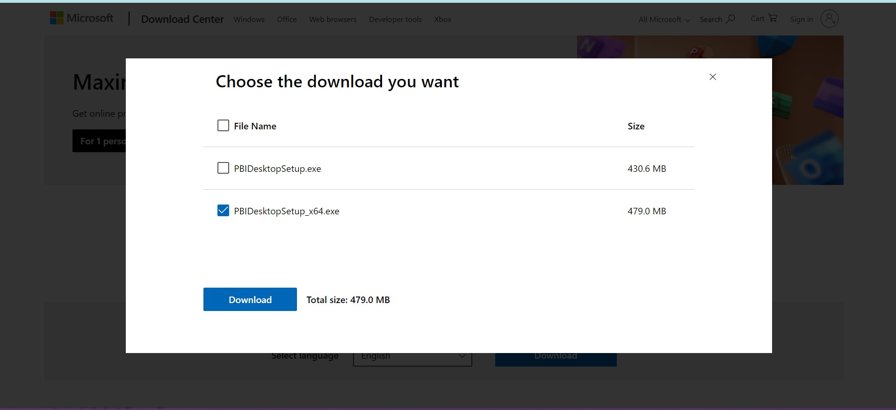
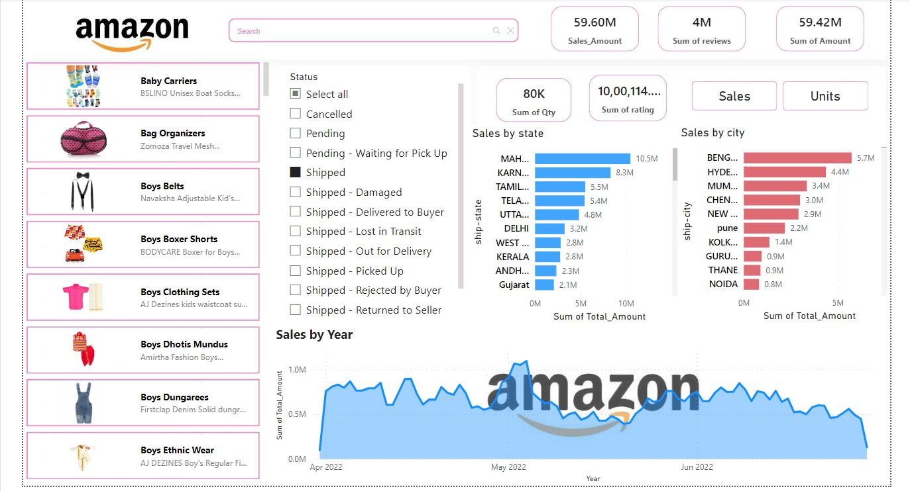
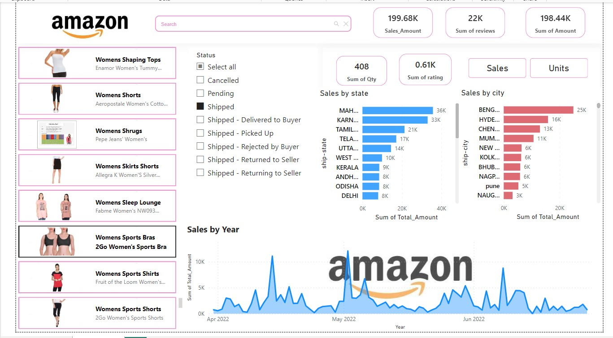

# Amazon Sales Report

 # BY Million Dollar Coder 
 ************************************************************************

Project Name :  Amazon Sales Report

Author :  VASANTH . M 

NickName : Million Dollar Coder

 Used: M language query, DAX formula language , google images  and  Visualizations 

Software Used : Power BI 

Date : 11 - 02 - 24


License : 

This project is open-source and available under the MIT License. You are free to use, modify, and distribute it as needed.
Please refer to the LICENSE file for more details. 

( https://github.com/vasanth312203/AMAZON---power-BI/blob/b964b1393bccd13b8669d73727d4d9a84b69117a/LICENSE )


# Description :

An Amazon Sales Report project using Power BI is a data visualization and business intelligence project that aims to analyze and present comprehensive insights into sales, revenue, profit, and various comparisons for Amazon sellers

Data Integration: 

The collected data is integrated with Power BI, a business analytics tool developed by Microsoft1.

Data Visualization:

Power BI is used to create interactive reports, charts, and dashboards that provide valuable insights into sales, inventory, customer behavior, and more14. This can help sellers identify trends, optimize their operations, and make informed decisions about their Amazon business4.

Metrics Used:

The report uses various metrics such as date, product, transactions, transaction revenue, marketplace, item status, quantity, item price, last updated date, order status, fulfillment channel, sales channel, order channel, item promotion discount, ship city, ship state, ship postal code, ship country


#  KEY URL's :
**To download the Power BI , visit the following URL:**
```
 https://platform.openai.com/account/api-keys](https://www.microsoft.com/en-us/download/details.aspx?id=58494

```



 # CHECK ICON:

```

https://i.postimg.cc/RV3LcN3L/check-2.png

```
 # SALES Query:

```
SalesOn = var selected = SELECTEDVALUE(Sale_Option[Type)
var _url = "https://drive.google.com/uc?export=view&id=1mcmb1peVHoaU5XL2bYXinZtW9sv2bNG4"
return IF(selected="1",_url)


```
 # UNITS Query:

```
SalesOn = var selected = SELECTEDVALUE(Sale_Option[Ty[e])
var _url = "https://drive.google.com/uc?export=view&id=1mcmb1peVHoaU5XL2bYXinZtW9sv2bNG4"
return IF(selected="2",_url)


```
 # SELLER Query:

```
Seller Count = CALCULATE([Sale_Units],ALL('amazon-fashion'[Category]))
= var val = CALCULATE(COUNT('amazon-fashion'[seller_id]),CONTAINSSTRING(Amazon[Status],"Delivered"))
return IF(val=BLANK(),"0",val)


```


 # FILTER Query:

```
Filter Sale = var selecting = SELECTEDVALUE(Sale_Option[Type])
var _units =SUM(Amazon[Qty])
var _sale = SUM(Amazon[Total_Ammount])
return IF(selecting="1",_sale,_units)


```


# Light Mode Images :







# STEP BY STEP  PROCEDURE :

1. Prepare Your Data:

   - Download the Amazon sales report in a compatible format such as CSV or Excel.

2. Open Power BI Desktop:

   - If you haven't already, download and install Power BI Desktop from the Microsoft website and  Open Power BI Desktop

3. Get Data:

   - Click on the "Get Data" button on the Home tab and  import your Amazon sales data

4. Load Data:

   - Power BI will then display a preview of your data. Click "Load" to import it into Power BI.

5. Transform Data (Optional):

   - If your data needs cleaning or transformation, Click on "Transform Data" to open the Power Query Editor.
   - Here you can perform tasks like renaming columns, removing duplicates, changing data types, etc.

6. Create Visualizations:

   - Once your data is loaded, go back to the main Power BI Desktop interface.
   - Choose the type of visualization you want to create (e.g., bar chart, line chart, table) from the Visualization pane on the right.
   - Drag and drop fields from your dataset onto the Values, Axis, or Legend areas of the visualization to define what data will be displayed.
c
7. Add Filters (Optional):

   - You can add filters to your visualizations to focus on specific subsets of data.

8. Create Calculated Columns or Measures (Optional):

   - Click on the "Modeling" tab and then select "New Column" or "New Measure" to create your calculations.

9. Design Your Dashboard:

   - Once you have created your visualizations, arrange them on the report canvas to create a dashboard.

10. Publish to Power BI Service (Optional):

    - If you want to share your dashboard with others or access it from anywhere, you can publish it to the Power BI Service.
    - Click on "File" > "Publish to Power BI" and follow the prompts to upload your report to the Power BI Service.


# GITHUB 


